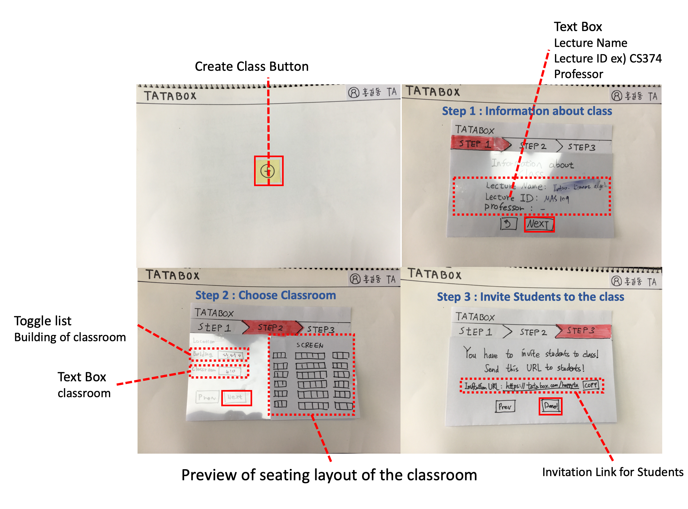
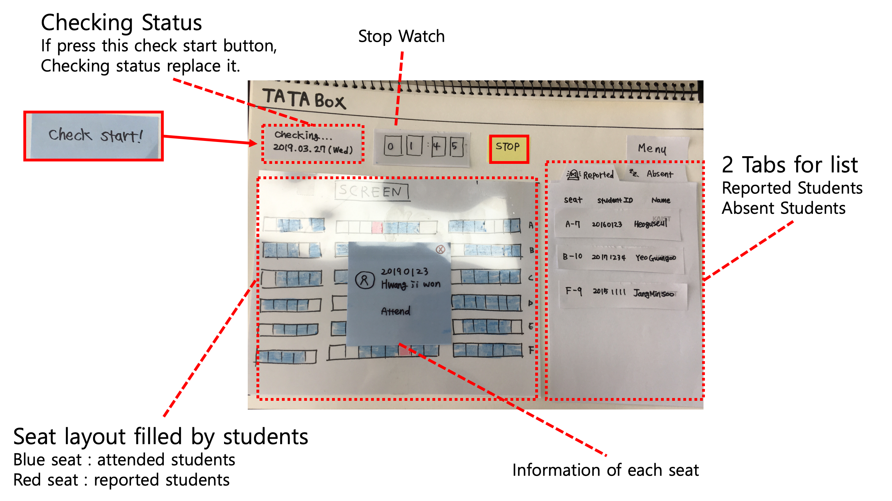
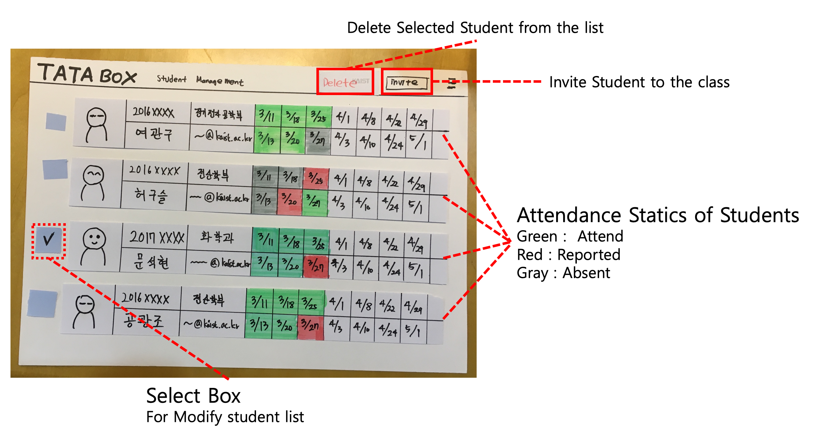
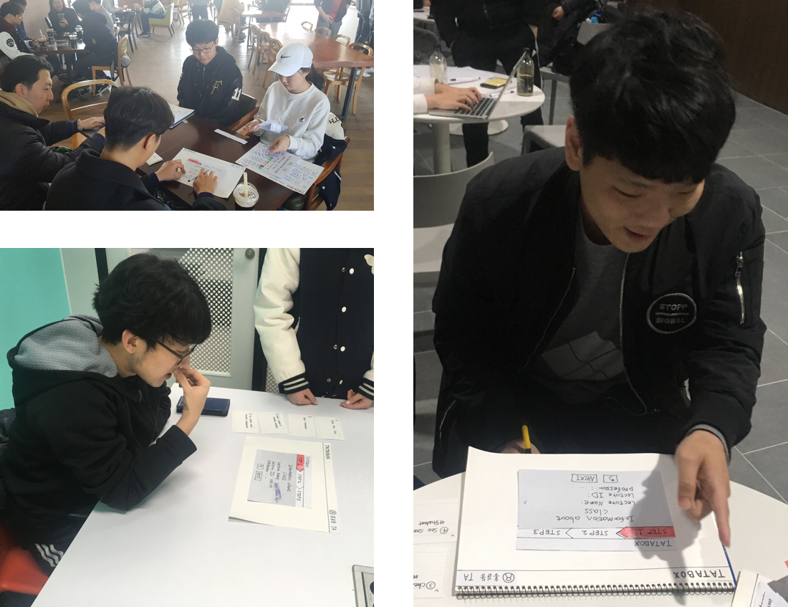

# DP3: Paper prototype

## Team **Cotton Candy Makers**

20160034 Gwangjo Gong
20160372 Gwangoo Yeo
20160696 Guseul Heo
20170223 SeokHyun Moon

## Prototype Explanation

### Task 1 : Make New Class

→ **Creating class** by choosing seating layout of the classroom and writing some information about the class.

### Task 2 : Check Attendance

→ **Check attendance** with the stop watch and **get the results** such as students who reported by others for cheating or didn't come to class after time over.

### Task 3 : Manage Students

→ **Use student management system** that shows user each student's current attendance checking state to administer students.

### Video for paper prototype

Here's some [video instruction](https://youtu.be/KuR8UxgUoFI) for our paper prototype. The [remixed version](https://youtu.be/ygIaDop-imc) is quite short but containing some beats like advertisement.

## Participants

**P1 (LEFT-Upper)** : MAS TA

- Large number of student
- Take a picture to check attendance

**P2** **(LEFT-Bottom)**: CHEM TA

- Medium number of student
- Call name to check attendance

**P3 (Right)** : NQE TA

- Small number of student
- Call name to check attendance

## Briefing

Process of the testing the paper prototype. Every test completed within 15 minutes.

1. Explain project's **needs and goals** to user.

    "Hello. We are taking a class called Human Computer Interaction, and our team is working on a project called 'Efficient attendance check for TAs'. For now, we made a simple paper prototype to test our project's interaction with TAs."

2. Explain **objective of overall process** to user.

    "Our project's task is composed of making new class, checking attendance, and managing students. You will be able to make you own class, Efficiently check attendance on it by inviting your students by a link and also manage the student in the Manage student tab."

3. Give **index cards** to user start observation.

    Follow this index card.

    1. Make new class
    2. Check attendance
    3. Check absent & reported students
    4. See student report at student management

    we can not help you while you test the prototype .

4. After user finish tasks, ask or answer **questions** and get **feedbacks**.

## Tasks

1. Create a class
2. Check attendance
3. Manage students.

## Observations

We organized our observations according to the Tasks we provided the participants. The information of TA who showed the observation is written on the side as (MAS), (CH), (NQE). 

Signs on the left side shows whether its positive observation or negative observation.

 **+ : Positive Observation**

 **- : Negative Observation**

The criticality of the observation was marked as following rules.

**Low criticality, Green**

Any problems that comes from lack of our prototype compared to the  web. It will be fixed naturally when we go over to computer prototype.

**Medium criticality, Yellow**

Problems that can be fixed with some addition. Some guidance, highlighting, or resizing can solve the problem.

**High criticality, Red**

Problems that has to be redesigned. We need to think about it more carefully to make better UI.

### Task1: Make new class

 + Button to create class is good to recognize. (MAS)

 + Recognized that he need to send link to the students by mail (NQE)

---

 - Don't know existence of toggle in text input box (MAS, CH, NQE)

 - Don't know what kind of building by building number at while choosing classroom (CH)

 - Didn't know what to do at start. Didn't understand + button at once (NQE)

 - Did not understand the preview part of choosing classroom and tried to check attendance on it (NQE)

### Task2: Check attendance

 + Clicked on the class right away (CH, NQE)

---

 - Not aware of stopwatch (CH, NQE)

 - Don't know how to start attendance check at first (MAS)

 - Didn't know how absent and reported tab worked, and understand after clicking on it (CH, NQE)

 - Didn't know the difference between absent and reported (NQE)

### Task3: Student management

 + Find student management well on the menu (CH)

 + clicked menu right away (NQE)

---

 - Difficult to understand what color means (CH)

 - Don't know the usage of Menu button (MAS)

 - complained about go back button (NQE)

### Other points

 + Use prototype very fast (MAS)

 + Didn't know anything about the website, but looked like he learned by clicking (NQE)

---

 - Index cards are not precisely showing the tasks (MAS)

 - Tutorial is needed (MAS)

 - Our prototype seems not straight forward (MAS)

 - Seems like a little bit confused. (MAS)

## Individual Reflection

> Gwangjo Gong

My role was **observer.** During the interview, I kept my mouth shut and observed participants.

These are some points which I mainly observed:

- Learnability
→ Can user recognize how to use our prototype fast enough?
- Look
→ Is there any difficulty for user  to understand prototype's overall design and layout?

Observing was interesting, but sometimes it was hard to keep my mouse shut. When I saw user misunderstood button's usage or showing unexpected behavior like skipping one task. 

I participated on 2 interviews out of 3.

> Gwangoo Yeo

Acted as a **Facilitator.**  I briefly explained to participants about our project and the purpose of the paper prototype. Then gave them the index card to read the tasks and asked them to follow it without any help from us. I participated on 2 interviews out of 3. 

While facilitating, it was hard to explain to the participants about our project. It was too hard to make it short while explaining all the details about our project. Because they don' t know the mechanism of our website, they had hard time understanding some features of it. However this problem might be one that we should cover with UI design.

> Guseul Heo

Acted as a **Computer.** In order to minimize the paper prototype's limitations, I acted as a computer by reacting as quickly as possible, especially in the stopwatch time update. I participated in all interviews of our team. It was difficult for me to keep my mouth shut when the user was testing. 

In contrast to what I thought TAs would understand without detailed explanation, user testing made me think that we needed some more explanation. Also, we thought TAs were used to English, so we made prototypes in English, and there were features that they did not understand because they were in English. For example, most TA we interviewed did not know exactly what "reported study" meant. Considering that our target user is not only KAIST TA but also university assistant, I thought it would be more reasonable to make the version of Korean.

> SeokHyun Moon

Acted as **Observer**, writing about the overall observations during the paper prototype testing. The main things that observed importantly are shown at below.

1. How user notice each button's functions
2. Whether user know what to do with only simple index card

While watching each user's performance of doing their tasks with our paper prototype, I wrote about their actions and the parts that confused user.

I participated in all interviews of our team.

During observing, it was difficult to stay still when user don't have any idea about what user have to do.

## Studio Reflection

1. I wish video is little bit slower.
→ Due to limit of presentation time, we had to make it on really fast tempo. Now we remade our video tempo so it can show whole procedure appropriately.
2. 'Create a class' seems less significant than other tasks.
→ We think TA's suggestion(Optimizing class seat layout) would be great. We'll try to upgrade our task 1 with it.
3. Feedbacks → Feedback
→ We are really sorry about our bad English. Now we will remember to not make mistake on the word 'Feedback'.